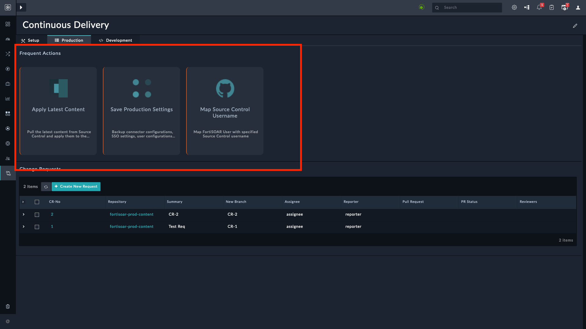

# Release Information

- **Version**: 1.0.1

- **Certified**: Yes

- **Publisher**: Fortinet  

- **Compatibility**: 7.3.0 and later

- **Applicable**: View Panel and Listing View

- [Release Notes](./widget/release_notes.md)

# Overview

The **Record Card** widget helps visualize records based on a specified data source. An example of using the record card widget would be displaying a list of tasks in the *Record Card view* on the **Production** and **Development** tab of the *Continuous Delivery* solution pack's page.

The following image highlights the configured Record Cards:

## Next Steps

| [Installation](./docs/setup.md#installation) | [Configuration](./docs/setup.md#configuration) | [Usage](./docs/usage.md) |
|----------------------------------------------|------------------------------------------------|--------------------------|