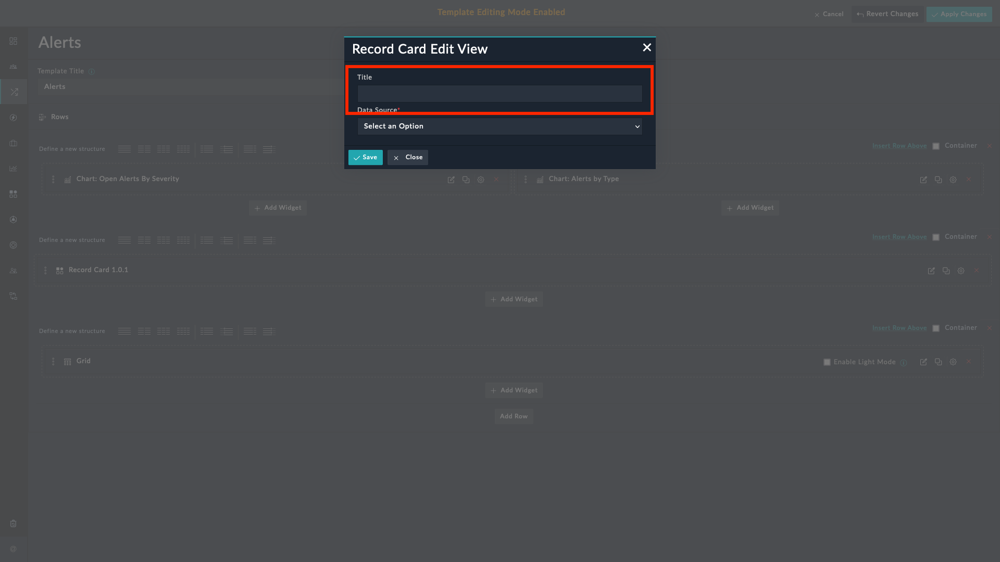
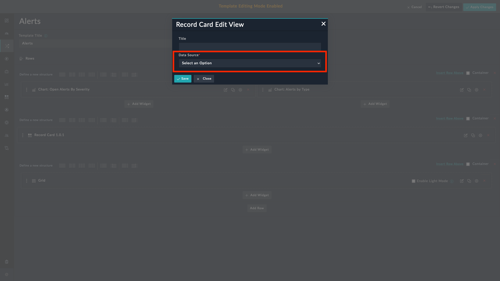
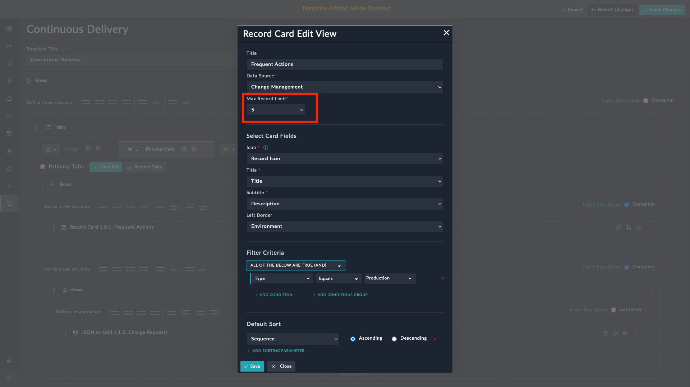
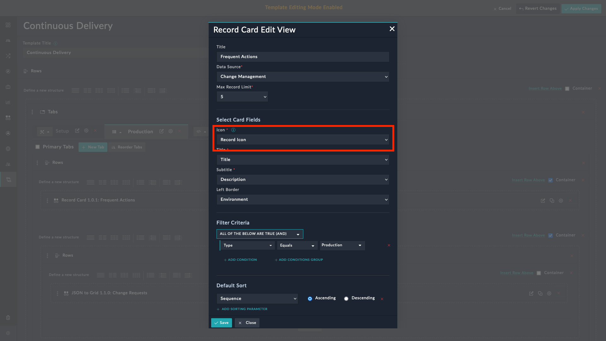
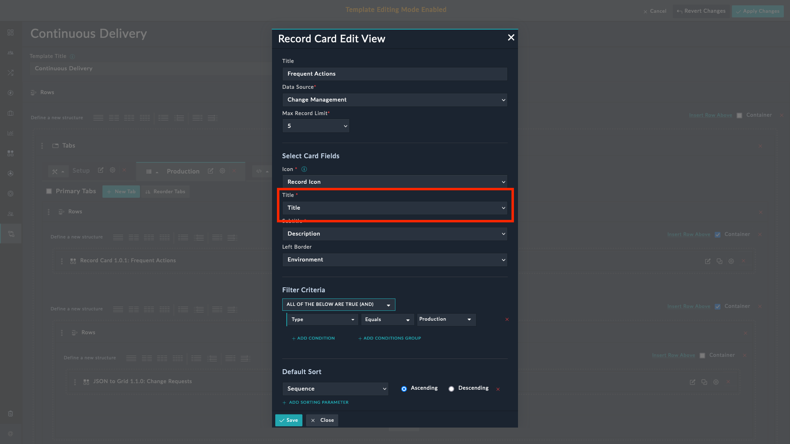
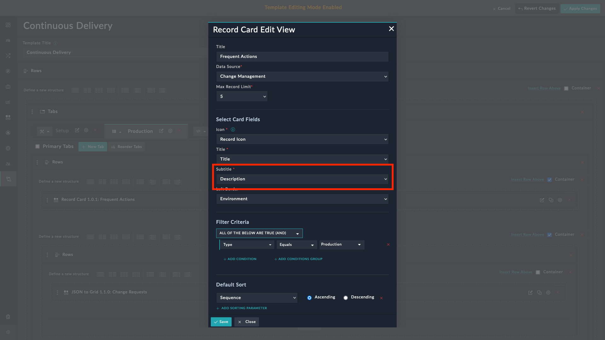
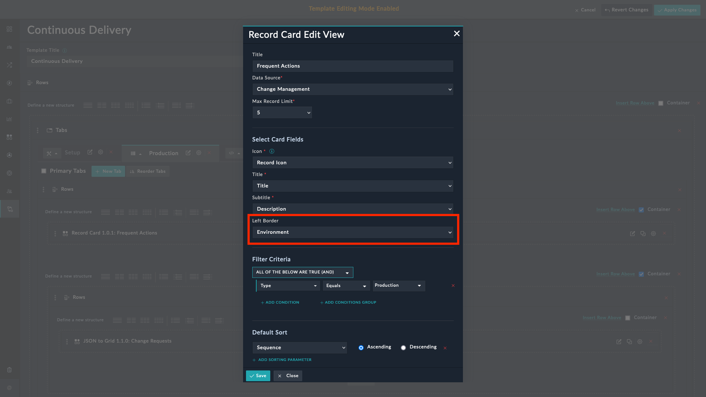
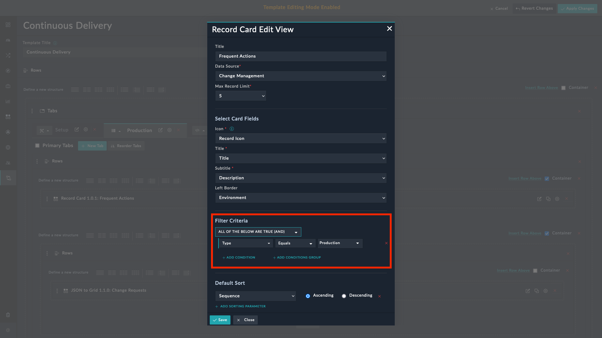
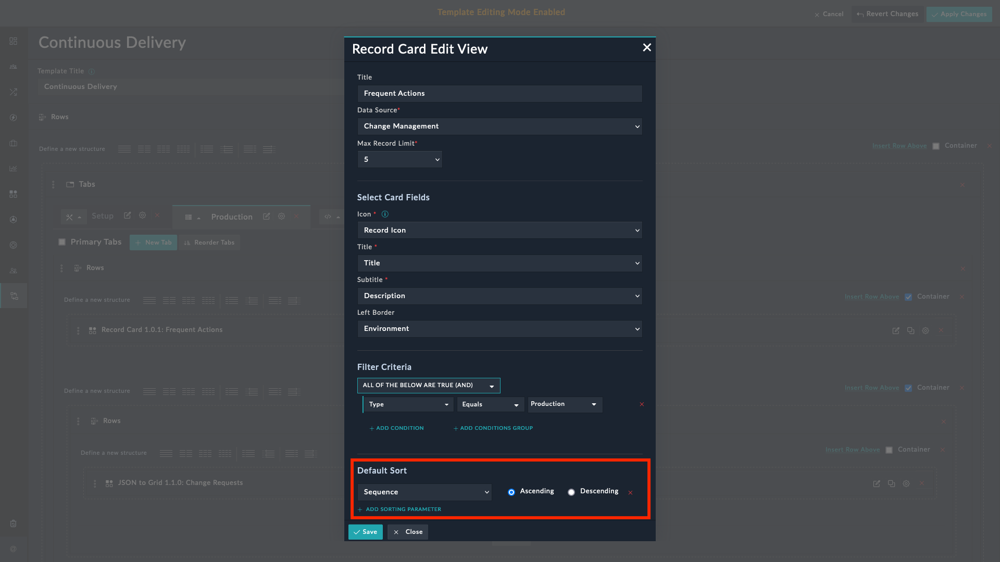

| [Home](../README.md) |
|----------------------|

# Usage

The **Record Card** widget helps visualize records based on a specified data source. An example of using the record widget would be displaying a list of tasks in the **Record Card** view on the Production and Development tab of the Continuous Delivery page.

## Features

- Visualize records based on the specified data source.
- Configure the widget by choosing an *icon*, *title*, *subtitle*, *left border*, and by specifying filters and default sort order.

  >**Note**: A maximum of 20 records are fetched for rendering details.

- To set the left border color of the tile, select an option from the picklist.

## Configuring Record Card Widget

As an example, in the following section we have used the widget with the **Change Management** module.

1. Edit a module's view template and select the **Add Widget** button.

2. Select **Record Card** from the list of installed widgets.

3. Specify a title of the widget in the **Title** field.

    

4. Select the module to use as data source in the **Data Source** field.

    

5. Select the maximum records to display in the **Max Record Limit** field.

    

6. Select the field containing the icon for the card from the **Icon** picklist.

    

7. Select the field containing the title for the card from the **Title** picklist.

    

6. Select the field containing the description of the card from the **Subtitle** picklist.

    

7. Select the field containing the left border color of the card from the **Left Border** picklist.

    

8. Specify the filter criteria to display only the relevant cards using the **Filter Criteria** field. For example, to display only those records whose `Type` is **Production**, add a filter criterion `Type Equals Production`.

    

9. Specify the sort order to display the filtered cards **Default Sort** field.

    

## Next Steps

| [Installation](./setup.md#installation) | [Configuration](./setup.md#configuration) |
|-----------------------------------------|-------------------------------------------|