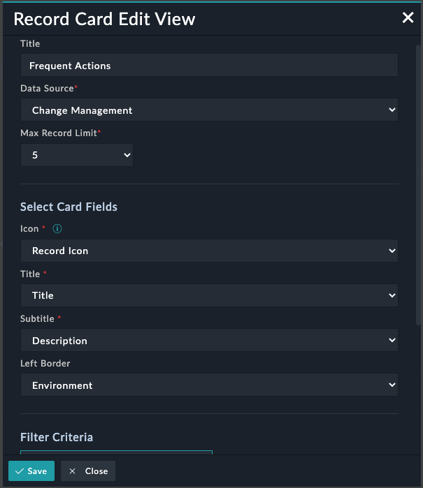
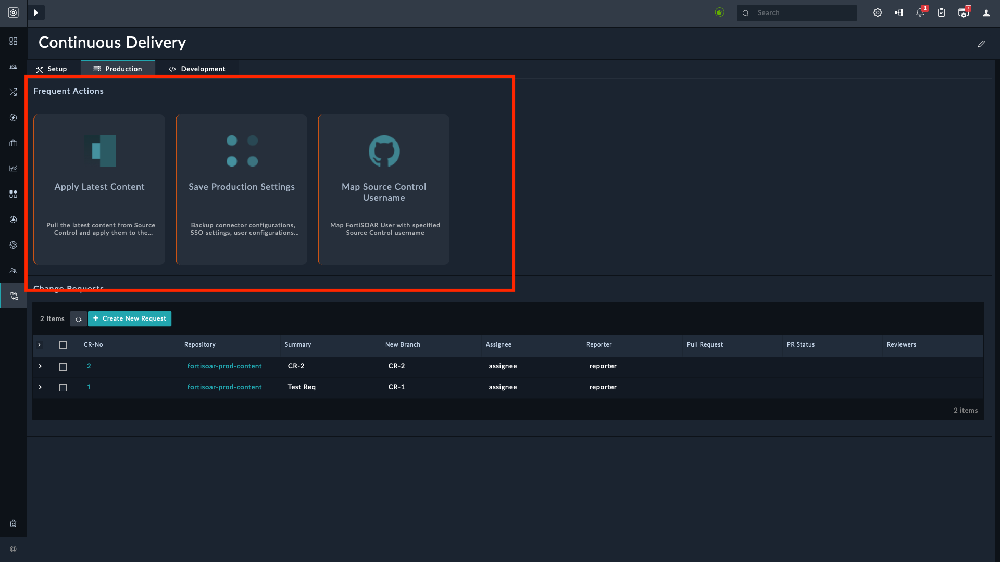

| [Home](../README.md) |
|--------------------------------------------|

# Usage

The Record Card widget helps visualize records based on a specified data source. An example of using the record widget would be displaying a list of tasks in the Record Card view on the Production and Development tab of the Continuous Delivery page.

Following pointers showcase how this widget seamlessly integrates with a solution pack such as **Continuous Delivery**:

- **Group records using a filter criterion**: To display only those records whose `Type` is `Production`, add a filter criterion such as `Type Equals Production`.
- Add this view on a list view or detail view of a module's record. 

## Features

- Helps users to visualize records based on the specified data source.
- Helps users to configure the widget by choosing an *icon*, *title*, *subtitle*, *left border*, and by specifying filters and default sort order.

  >**Note**: A maximum of 20 records are fetched for rendering details.

- To set the left border color of the tile, select an option from the picklist.

## Record Card Widget Views

### Record Distribution Widget - Edit View

### Record Distribution Widget - List View

