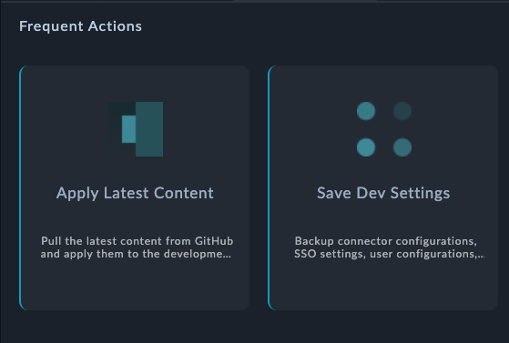

| [Home](../README.md) |
|--------------------------------------------|

# Usage

The Record Card widget provides the ability to visualise records based on a specified data source. An example of using the record widget would be displaying a list of task in the Record Card view on the Production and Development tab of the Change Management page.

- Ability to group records using a the filter Criteria, display only those records whose Type is Production, you can add a filter criterion such as `Type Equals Production`.
- Ability to add this view on a list view, or detail view of a module's record. 

## Features

- Allows users to visualise records based on the specified data source.
- Allows users to configure the widget by choosing icon, Title, Subtitle, Left Border, specifying filters and default sort.  
  **Note**: A maximum of 20 records are fetched for rendering details.
- Select the picklist field whose value you want to set as the left border of the card if the selected field's options contain defined color codes.

## Record Card Widget Views

### Record Distribution Widget - Edit View

### Record Distribution Widget - List View

